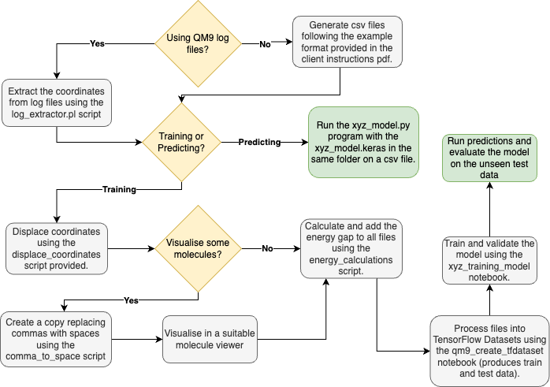

# Equilibrium Molecule Classifier

This project is a Graph Neural Network which classifies a molecule as being in equilibrium or out of equilibrium based on its atoms and their xyz coordinates. For a detailed usage instructions please refer to the Client Instructions PDF.

This README is to provide future developers an overview of what is provided in this project and the workflow to follow. The two core training notebooks contain details instructions along with the Data_Pipeline.png file.

## Document List
1. xyz_training_model.ipynb
2. qm9_create_tfdataset.ipynb
3. xyz_model_analysis.ipynb
4. log_extractor.py
5. energy_calculations.py
6. displace_coordinates.py
7. comma_to_space.py
8. xyz_model.py
9. "Final Project Report.pdf"
10. "Client Instructions.pdf"
11. log_extractor.pl
12. log_script_single.pl

## System Requirements and Dependencies
1. Python version 3.11+
2. Perl
3. Access to Google Colab or a similar runtime environment.
4. Scikit-learn (any version)
5. pyscf (any version)
6. TensorFlow version 2.16+ 
7. Pandas version 2.2.3+
8. Matplotlib
5. Other dependencies are included in the notebooks as imports e.g. numpy, keras and so on.

## Project Usage Flow Chart


## Workflow Steps
1. If working with the QM9 dataset there is a script `log_extractor.pl` which contains instructions for extracting the required moleculer spatial coordinates from the log files.
2. The extracted files will appear as presented here (if you are producing your own molecular data, this is the required starting point) in csv format:
    ```
    C,2.152789,1.401974,0.597515
    C,1.998043,0.223677,-0.359047
    O,3.149622,-0.608604,-0.386871
    C,0.782749,-0.648626,-0.041220
    O,-0.396569,0.166622,-0.190805
    C,-1.564498,-0.425885,0.068045
    N,-1.683472,-1.634127,0.433307
    C,-2.672251,0.496153,-0.122281
    N,-3.596210,1.177815,-0.253258
    H,3.031185,1.993769,0.327938
    H,1.270360,2.046388,0.569160
    H,2.277629,1.048408,1.629434
    H,1.889483,0.597758,-1.383445
    H,3.390302,-0.814685,0.523311
    H,0.728477,-1.499685,-0.725138
    H,0.822759,-1.037900,0.983223
    H,-2.657830,-1.887772,0.578517
    ```
3. (Optional) - If you would like view these molecules, you can do so by running the `comma_to_space.py` script on a file and pasting the output into this [Molecule Viewer](https://liwt31.github.io/2022/01/02/online_viewer/) or an equivalent program.
4. Next, for training you will need to generate displaced version of your molecules. For this, you can use the `displace_coordinates.py` script that contains instructions to configure the displacement you would like. Ensure, you keep the valid and invalid files in seperate directories at this point.
5. Then, to generate the energy gap values, run your files through the `energy_calculations.py` script. Detailed instructions on input-output are contained within, but the essential thing is that molecules of each class i.e. equilibrium and non equilibrium are in seperate input directories.
6. Now, refer to the `qm9_create_tfdataset.ipynb` notebook which requires either Google Colab or a similar runtime environment. The notebook has detailed instructions and after this your data will be ready to be fed into the training model.
7. For training, open `xyz_training_model.ipynb` and follow the very detailed steps on how to pass your data through and train the model yourself. Evaluation and prediction is covered at the end of the notebook.
8. (Optional) - For more in-depth analysis, open 'xyz_model_analysis.ipynb' and follow the descriptions and instructions to enable the model evaluation. This is primarily for our original model and test data or similar items.
9. Finally if you refer to `Client Instructions.pdf` you can follow the steps for solely loading and running the model in inference mode.